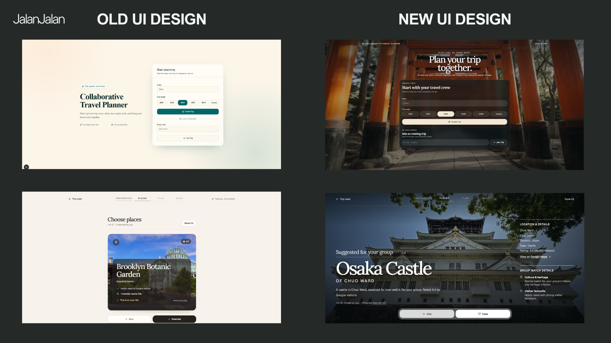
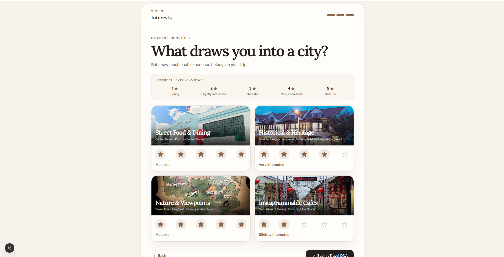
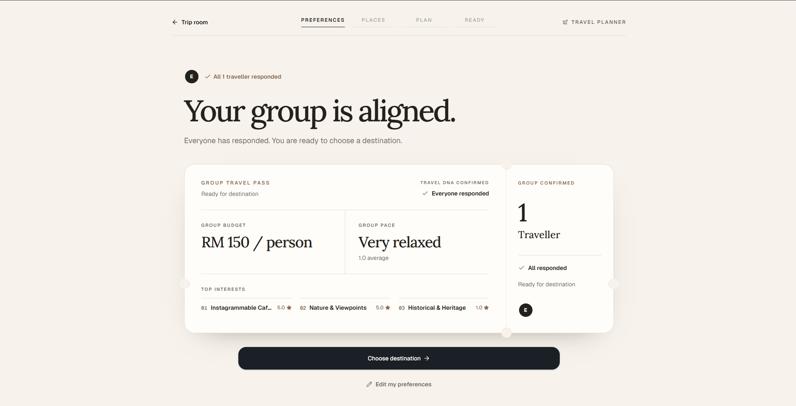
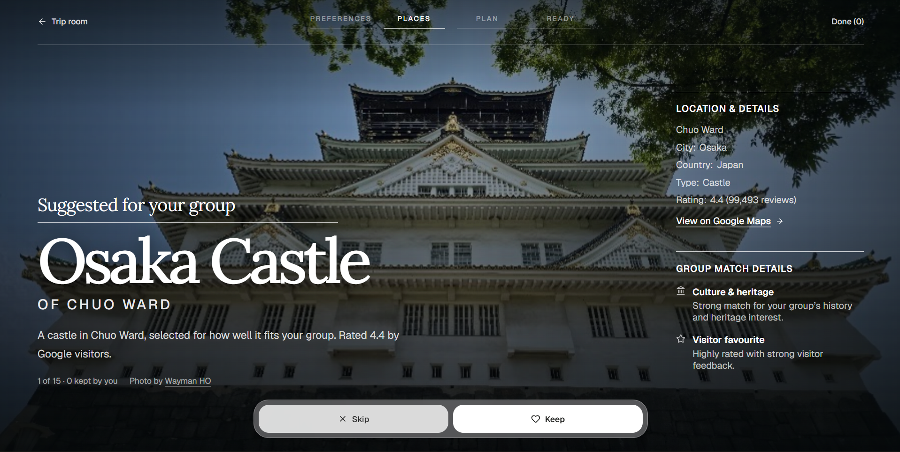
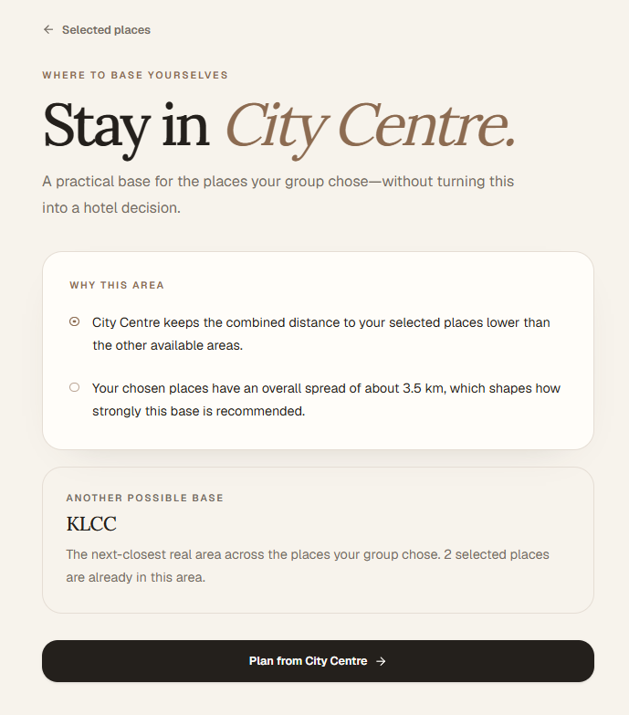
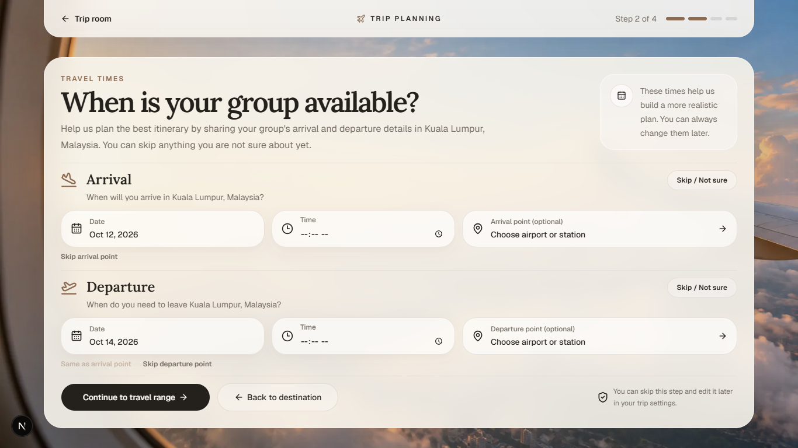
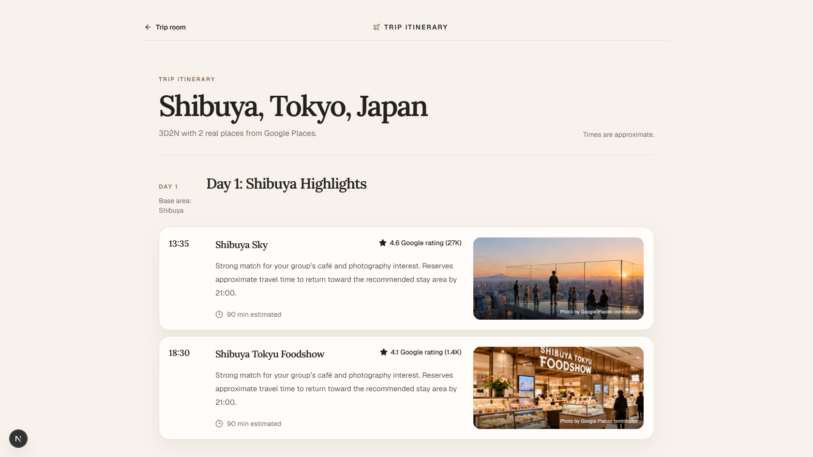
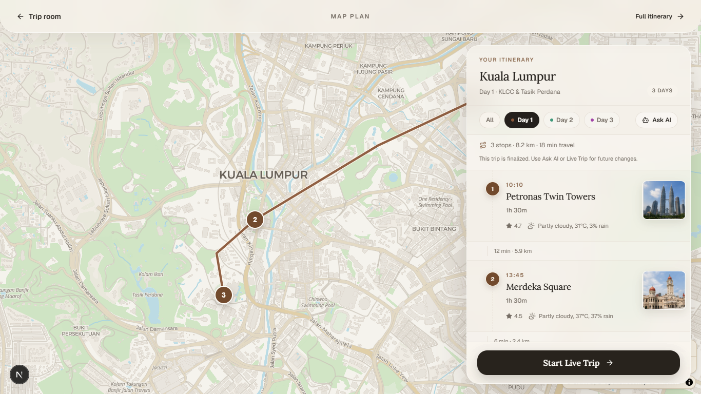
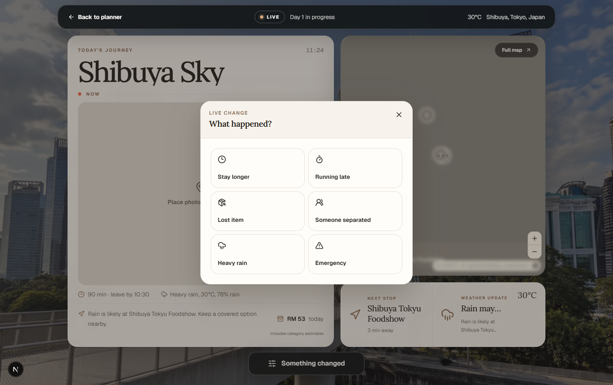
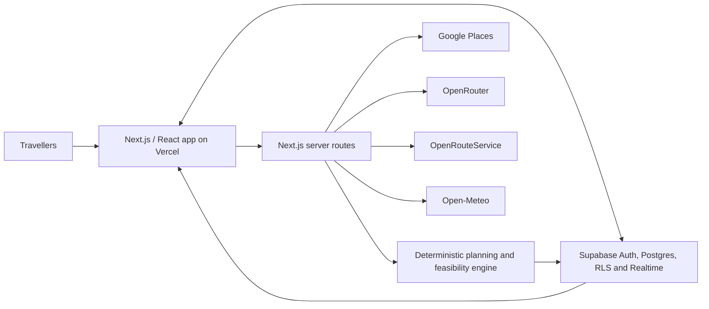

# JalanJalan by Kampung Ren

**Team:** Kampung Ren — Ethan Lim Yik Hern, Deric Ong Yong Quan, Tham Kai Le

**Problem Statement:** Travel Planner

**Live Demo:** [https://jlnjln.vercel.app](https://jlnjln.vercel.app)

**Video Presentation:** [Watch on YouTube](https://youtu.be/T0j4UQ7uBC0)

**Presentation Slides:** [View the Canva presentation](https://canva.link/4g8qaylfieh5jw9)

> **JalanJalan** turns a group of travellers' individual preferences into one practical, shared itinerary—before the trip and while plans are changing on the ground.

## 1. Project Overview

### The Problem

Planning a group trip is rarely just a search problem. Travellers have different budgets, interests, energy levels, arrival times, and must-visit places. These details are usually scattered across group chats, spreadsheets, map pins, and individual travel apps. One person eventually becomes the unofficial planner, compromises are difficult to explain, and the final itinerary may still contain unrealistic routes, closed attractions, or too many activities for the available time.

The main stakeholders are groups of friends and families travelling together, especially the trip organiser who currently carries most of the planning workload. Tourism businesses and local attractions are secondary stakeholders because better-matched plans can connect travellers with places they are more likely to enjoy.

[Wanderlog](https://wanderlog.com/trip-planner-ai) already combines itineraries, maps, collaboration, AI suggestions, and route optimisation, while [TripIt](https://www.tripit.com/web/free) is strong at collecting existing reservations into one itinerary. However, these tools mainly help travellers organise or co-edit a plan after decisions are made. JalanJalan makes every traveller's structured preferences and place votes explicit inputs to the plan, then protects the group's consensus with deterministic scheduling and feasibility checks. Its focus is not simply storing or generating an itinerary, but helping a group reach and maintain an explainable compromise.

### Our Solution

JalanJalan is a collaborative travel-planning web application for groups. Travellers join a private room, complete a short **Travel DNA** questionnaire, and vote on real places matched to the group's combined preferences. The application turns those choices into a grounded itinerary that accounts for pace, opening hours, geography, travel time, arrival and departure constraints, and the group's stay. After the plan is finalised, **Live Mode** helps the group respond to delays, weather, emergencies, or other changes without rebuilding the trip from scratch.

#### Feature Set

- Private, six-digit trip rooms with passwordless anonymous access
- Realtime member presence and shared planning progress
- Travel DNA questionnaire covering per-person budget, pace, and interests
- Group preference summary that unlocks when everyone is ready
- Destination, trip-date, arrival, departure, and travel-range setup
- Real place discovery and photographs through Google Places
- Group place voting with visible consensus tiers
- Suggested shortlist based on the group's Travel DNA and available trip capacity
- Stay-area recommendation and exact accommodation anchoring
- Deterministic daily scheduling with meal, opening-hour, distance, and time-window constraints
- AI-assisted itinerary generation and constrained natural-language edits
- Interactive map, route lines, stop ordering, travel time, and day filters
- Weather forecasts attached to scheduled stops
- Host-controlled trip finalisation with protected collaborative state
- Live Mode responses for staying longer, running late, losing an item, separation, heavy rain, and emergencies

## 2. Ideation & Process

### 2.1 Ideas We Considered

Chosen ideas are listed first.

| Idea / Feature | Decision | Why it was kept or dropped |
| --- | --- | --- |
| Travel DNA + place voting | Kept | Helps combine personal preferences with visible group consensus instead of allowing one traveller to make every decision. |
| Deterministic scheduling | Kept | Makes the itinerary more realistic, repeatable, testable, and explainable. |
| AI itinerary editing | Kept | Supports flexible changes while constraining AI to grounded places and validated schedules. |
| Live Mode + weather updates | Kept | Helps the plan adapt during the actual trip when conditions no longer match the original itinerary. |
| Full hotel / flight booking | Dropped | Added too much complexity and was outside the core group-planning focus. |
| RedNote integration | Dropped | Official API access was not practical for the prototype. |
| Boarding pass / route splitting | Dropped | Lower priority than completing the core collaborative planning flow. |

### 2.2 Ideation Boards

Most of our ideation happened through face-to-face discussion. Rather than jumping directly to the final feature set, we repeatedly narrowed the problem and added structure only when the previous concept could not resolve the next planning challenge:

**Recommendation App → Group Preference System → Consensus Layer → Deterministic Planner → Live Adaptive Trip**

1. **Recommendation App** — We began with personalised place suggestions, but recommendations alone did not resolve disagreements within a group.
2. **Group Preference System** — Travel DNA gave every traveller a structured way to express budget, pace, and interests.
3. **Consensus Layer** — Place voting made agreement visible and prevented the loudest person from controlling the itinerary.
4. **Deterministic Planner** — We separated AI suggestions from scheduling so that time windows, opening hours, travel distance, meals, and group priorities could be validated consistently.
5. **Live Adaptive Trip** — We extended the plan into the journey itself, allowing the group to respond to delays, weather, separation, and emergencies.



The comparison records our interface iteration. The earlier design prioritised proving the room and place-selection flow; the later design improved hierarchy, visual context, and the emotional experience of planning a trip together while preserving the same core decisions.

### 2.3 Mentor Consultation

| Date and Time | Mentor | Feedback Received | What Was Changed |
| --- | --- | --- | --- |
| 12 September 2026, 10:40 PM | Varsha Selvakumar | The mentor did not join the scheduled consultation, so no feedback was received. The team waited for one hour and followed up by tagging the mentor in the group chat; supporting evidence was retained. | No mentor-directed changes were made because no consultation feedback was received. |

#### Consultation Evidence


At 10:46 PM, shortly after the scheduled start, the team tagged the mentor in the group chat to confirm whether she was available to join.


The team remained in the consultation voice channel for approximately one hour. The evidence is included to document the attempted engagement, not to attribute blame.

## 3. Design & Prototype

**UI Prototype:** [Open the public Vercel deployment](https://jlnjln.vercel.app)

The following screenshots show eight key parts of the current prototype and the complete journey from individual preferences to an adaptive live trip.

### Travel DNA



Each traveller rates experience categories on a five-point scale. Together with budget and pace, these responses form the structured Travel DNA used by the group recommendation system.

### Group Preference Summary



Completed responses are combined into a shared view of budget, pace, and top interests. This gives the group a visible basis for discussing the trip before selecting a destination or place.

### Place Selection



Grounded place cards explain why each suggestion matches the group. Each traveller can keep or skip a place, turning individual choices into visible group input for the consensus and scheduling stages.

### Stay Recommendation



After the group chooses its places, JalanJalan recommends a practical area to stay by comparing their combined distance and geographical spread. It also presents a nearby alternative while keeping the recommendation separate from an actual hotel-booking decision.

### Travel Boundaries



The host can add or skip arrival and departure dates, times, airports, and stations. These boundaries become constraints for the first and final day rather than ordinary itinerary stops.

### Grounded Itinerary



The itinerary uses real Google Places, photographs, ratings, estimated visit durations, and a short explanation of why each stop matches the group.

### Interactive Map Plan



The final plan connects ordered stops on an interactive map and presents day-specific distance, travel time, weather, photographs, and itinerary details in one view.

### Live Mode



During the trip, travellers can report common disruptions such as delays, separation, heavy rain, or an emergency and adjust the plan from the current situation.

## 4. What Makes It Different

| Capability | What is distinctive in JalanJalan |
| --- | --- |
| Travel DNA | Every traveller provides structured budget, pace, and interest preferences before planning begins. The group summary is derived from all completed responses. |
| Consensus before generation | Place voting remains visible and meaningful. Unanimous and high-consensus places receive stronger scheduling priority than individual choices. |
| Deterministic planning core | AI does not directly write an unchecked itinerary. A deterministic engine owns capacity, day clustering, opening hours, meal fit, geographical ordering, and final validation. |
| Grounded AI | AI suggestions and edits operate on real place identities and structured outputs. Invalid plans are rejected before persistence. |
| Arrival-to-stay-to-departure routing | Airports, stations, and accommodation are treated as route anchors. They shape the schedule without being counted as attractions. |
| Explainable overflow | When every selected place cannot fit, lower-priority choices move to an optional list instead of silently disappearing or breaking the schedule. |
| Planning-to-live continuity | The final itinerary becomes an operational trip view with current weather, the next stop, route context, and event-specific change controls. |

JalanJalan does not try to replace booking platforms. Its original contribution is the decision layer between “everyone has opinions” and “the group has a feasible plan.”

## 5. Technical Architecture & Feasibility

### Tech Stack

| Layer | Technology | Why We Chose It | Constraints / Risks |
| --- | --- | --- | --- |
| Frontend | Next.js 16 App Router, React 19, TypeScript, Tailwind CSS 4 | Provides a typed, responsive application with server and client capabilities in one codebase. | Requires Node.js 22.13+ and careful separation of server-only secrets from browser code. |
| UI and interaction | Base UI, shadcn components, Lucide icons, dnd-kit | Accessible primitives and reusable controls speed up prototype development; dnd-kit supports itinerary reordering. | Complex realtime and drag interactions still require cross-device testing. |
| Backend | Next.js route handlers and server modules | Keeps authenticated API logic, AI calls, place lookups, routing, and validation close to the frontend. | External provider quotas and timeouts require explicit fallback and error states. |
| Database and authentication | Supabase Postgres, anonymous authentication, Row Level Security, RPC functions | Supports passwordless rooms, durable shared state, realtime changes, and database-level access control on a free-to-start platform. | Anonymous sign-in needs anti-abuse controls such as CAPTCHA and rate limiting before a larger public launch. |
| AI | OpenRouter with schema-constrained JSON responses | Allows model choice while keeping AI outputs structured and server-side. | Model availability, latency, and cost vary; deterministic validation must remain the final authority. |
| Place data | Google Places API and Google Places Photos | Grounds recommendations in real locations, coordinates, ratings, opening information, and photos. | Requires API billing, quotas, attribution, and safe server-side key handling. |
| Maps | MapLibre GL with CARTO basemaps; Google Maps 3D for destination preview | MapLibre provides a flexible interactive itinerary map without locking the core planner to one display provider. | Public tile services have usage policies; production scale may require a dedicated map provider. |
| Routing | OpenRouteService | Produces road-aware route geometry, distance, and travel duration between grounded stops. | Free-tier quotas and coverage can fail, so the planner exposes a Haversine fallback state. |
| Weather | Open-Meteo | Provides forecast data without requiring a client-side secret. | Forecast accuracy and available horizon vary by location and date. |
| Hosting | Vercel + Supabase | Vercel matches the Next.js deployment model; Supabase hosts authentication, Postgres, RLS, RPCs, and realtime subscriptions. | All environment variables and database migrations must be configured separately for production. |

### System Architecture



AI proposes within a structured boundary, while the deterministic planning engine validates pace, capacity, geography, opening hours, route state, and arrival/departure rules before an itinerary is saved.

### Build Plan & Scope

The prototype scope is deliberately centred on **planning and adapting one shared trip**, not booking or payments.

1. **Collaborative foundation** — create and join private rooms, establish anonymous identities, secure data with RLS, and synchronize member state.
2. **Preference collection** — collect Travel DNA from each traveller and reveal a group summary only when everyone has completed it.
3. **Grounded choice** — configure destination and travel boundaries, retrieve real places, rank suggestions, and collect group votes.
4. **Feasible itinerary** — cluster selected places into practical days, schedule them deterministically, route them, and prevent invalid plans from being saved.
5. **Review and finalisation** — provide itinerary and map views, weather context, AI-assisted edits, and a host-controlled finalisation step.
6. **During-trip adaptation** — provide Live Mode and a constrained set of change scenarios without expanding into booking, ticketing, or full travel operations.

### Feasibility Evidence

- 80 automated domain tests currently pass.
- TypeScript validation currently passes with `npm run typecheck`.
- The Next.js production build currently completes successfully with `npm run build`.
- The test suite covers consensus, Travel DNA ranking, trip capacity, opening hours, meal fit, route direction, arrival/departure constraints, stay anchoring, AI persistence gates, fallbacks, finalisation, and host permissions.
- Future production hardening would focus on broader end-to-end browser coverage, provider resilience, rate limiting, and abuse protection.

## Local Setup

### Prerequisites

- Node.js 22.13 or newer
- A Supabase project with anonymous sign-ins enabled
- Supabase CLI or access to the Supabase SQL editor
- API keys for the enabled external integrations

### Installation

```bash
npm install
```

Copy `.env.example` to `.env.local` and fill in the required values:

```dotenv
NEXT_PUBLIC_SUPABASE_URL=
NEXT_PUBLIC_SUPABASE_PUBLISHABLE_KEY=
NEXT_PUBLIC_GOOGLE_MAPS_API_KEY=
OPENROUTER_API_KEY=
OPENROUTER_MODEL=
GOOGLE_PLACES_API_KEY=
OPENROUTESERVICE_API_KEY=
```

Apply the SQL files in `supabase/migrations/` in filename order, or link the project with the Supabase CLI and run:

```bash
supabase db push
```

To populate the curated Malaysia place catalogue when required:

```bash
npm run seed:malaysia-places
```

Start the development server:

```bash
npm run dev
```

Open [http://localhost:3000](http://localhost:3000).

### Verification

```bash
npm run typecheck
npx tsx --test tests/*.test.ts
npm run build
```

For collaborative testing, open two isolated browser sessions. Create a trip in the first session, join it with the six-digit code in the second, complete Travel DNA for both travellers, and continue through voting, scheduling, finalisation, and Live Mode.

## Known Limitations

- External APIs require valid keys, quotas, and network access; fallback behaviour cannot replace every provider feature.
- Anonymous access is suitable for the prototype but needs production-grade rate limiting and bot protection.
- The current scope does not include flight or hotel booking, payments, expense splitting, offline access, or RedNote integration.
